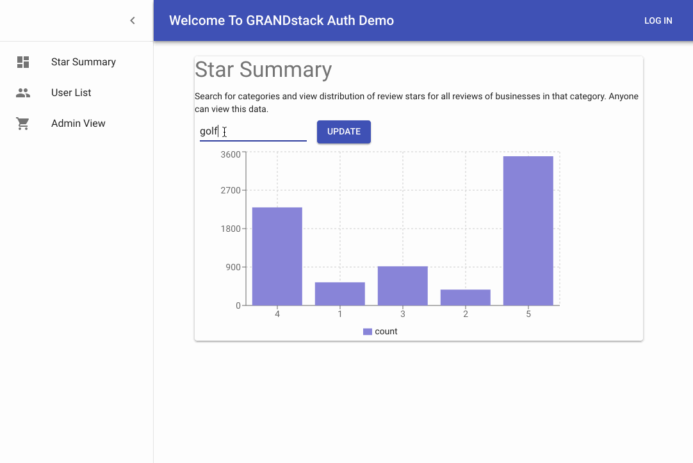

# GRANDstack Starter Auth0 Demo App

This project is forked from the [GRANDstack starter project](https://grandstack.io/docs/getting-started-grand-stack-starter.html) (GraphQL, React, Apollo, Neo4j Database) and demonstrates a GraphQL schema directive approach for implementing authorization in a GraphQL API using Auth0 and the [graphql-auth-directives](https://www.npmjs.com/package/graphql-auth-directives) module.

Try is out at [auth-demo.grandstack.io](https://auth-demo.grandstack.io)

